[TOC]

---

### project 전체 코드

> <https://github.com/jungeunlee95/bookmall-project>

---

# bookmall 계정 생성

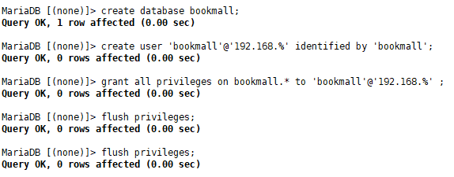

---

# Schema 생성

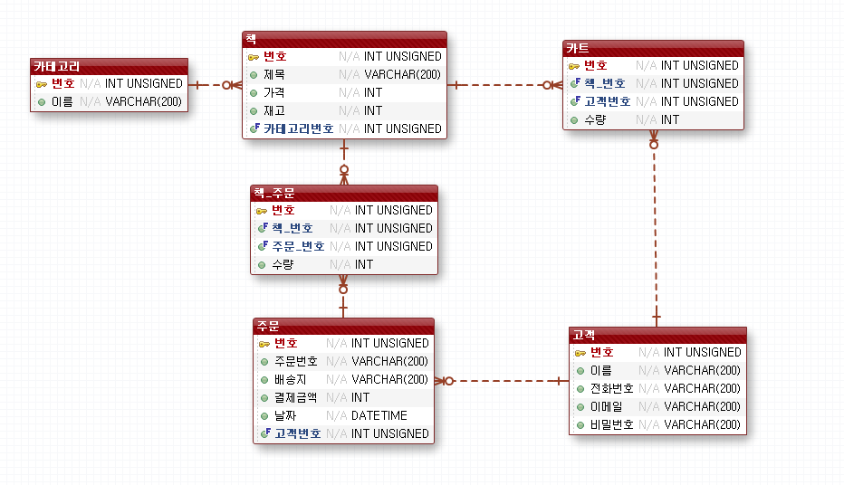

---

# 프로젝트 package 구성

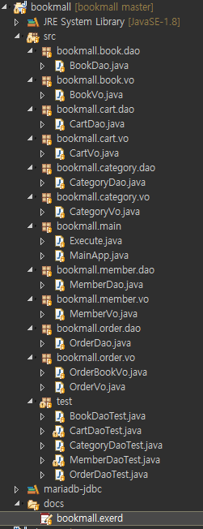

# Test

**회원 추가**

> 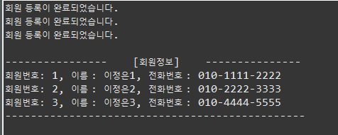

**카테고리 추가**

> 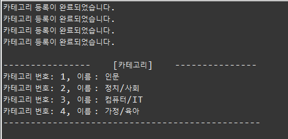

**책 추가**

> 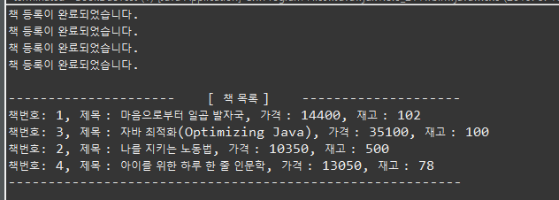

**회원이 장바구니에 책 담기**

> 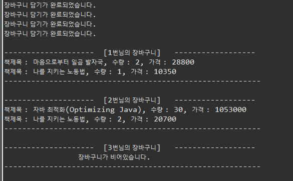
>
> 3번도 장바구니 담기
>
> 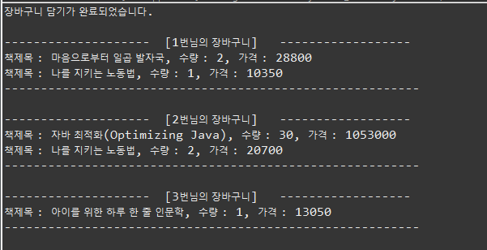

---

**주문하기**

> 2번 회원 주문
>
> 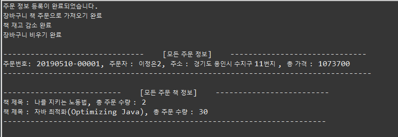
>
> 한명 더 주문 - 3번 회원
>
> 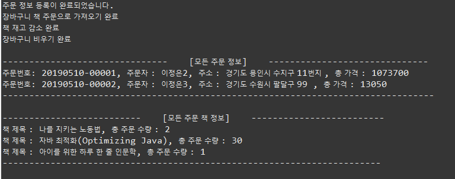

**주문 후**

> 책 재고 감소
>
> 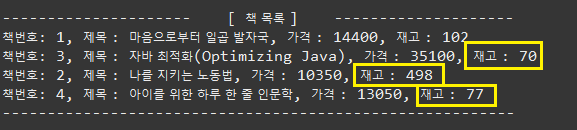
>
> 주문한 회원 장바구니 비우기
>
> 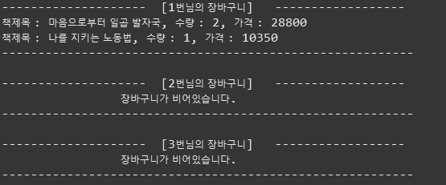

---


---

## 정리

**주문정보 등록시 주문번호, 가격**

```mysql
insert into orders(no, order_no, address, total_price, member_no)  
values(null, concat(DATE_FORMAT(now(),'%Y%m%d'), '-',  
lpad( (( select count(*) 
from orders ALIAS_FOR_SUBQUERY 
where DATE_FORMAT(today, '%y%m%d') = DATE_FORMAT(now(), '%y%m%d') )+1), '5', '0' )), 
1,    (select sum(amount*price)
from cart c, book b 
 where c.book_no = b.no  and member_no = 1), 1 );
```

> **주문번호**
>
> ```mysql
> concat(DATE_FORMAT(now(),'%Y%m%d'), '-', lpad( (( select count(*) 
> from orders ALIAS_FOR_SUBQUERY 
> where DATE_FORMAT(today, '%y%m%d') = DATE_FORMAT(now(), '%y%m%d') )+1)
> ```
>
> 일단 주문취소는 생각하지않고 오늘 날짜 주문 건수를 가져와 format함

> **총 가격**
>
> ```mysql
> select sum(amount*price)
>  from cart c, book b 
> where c.book_no = b.no  and member_no = ?
> ```
>
> 해당 회원의 장바구니 모든 상품의 총 합 가격!


해당 주문번호(PK) 가져와서 바로 book_order 테이블에 넣기 위해 바로 sql 실행

```mysql
select LAST_INSERT_ID();
```

---


---

**You can't specify target table '테이블명' for update in FROM clause 에러**

.. 이것때문에 한시간 고생했다.......

```mysql
insert into orders(no, order_no, address, total_price, member_no) 
values(null, concat(DATE_FORMAT(now(),'%Y%m%d'), '-', 
        lpad( ((select count(*) from orders ALIAS_FOR_SUBQUERY )+1), '5', '0' )),
       '주소',
       (select sum(b.price)
			from cart c, book b
			where c.book_no = b.no 
			and member_no = 1), 
		1 );
```

**MariaDB에서 insert, update, delete에서 서브쿼리로 동일한 테이블의 조건을 사용시 발생하는 에러**

**오라클을 사용하던 사용자는 쿼리에 에러가 있는 것도 아닌데 왜 에러가 발생하는지 알방법이 없습니다.**


**1. 에러가 발생하는 쿼리 예**

```mysql
INSERT INTO board ( seq, name )
VALUES ( (SELECT MAX(seq) FROM board), name);
```

**insert 하려는 테이블과 서브쿼리의 테이블이 동일한 것**


**2. 해결방법**

**서브쿼리 내부의 테이블에 별칭을 주면 됨!**

```mysql
INSERT INTO board ( seq, name )
VALUES ( (SELECT MAX(seq) FROM board a), name);
```

[참고사이트](<https://shinheechul.tistory.com/30>)

